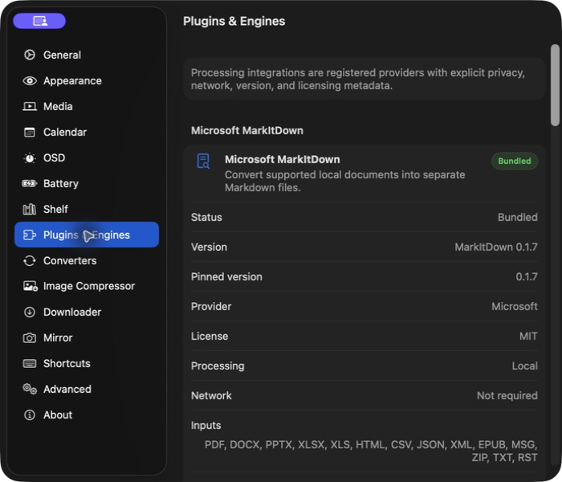
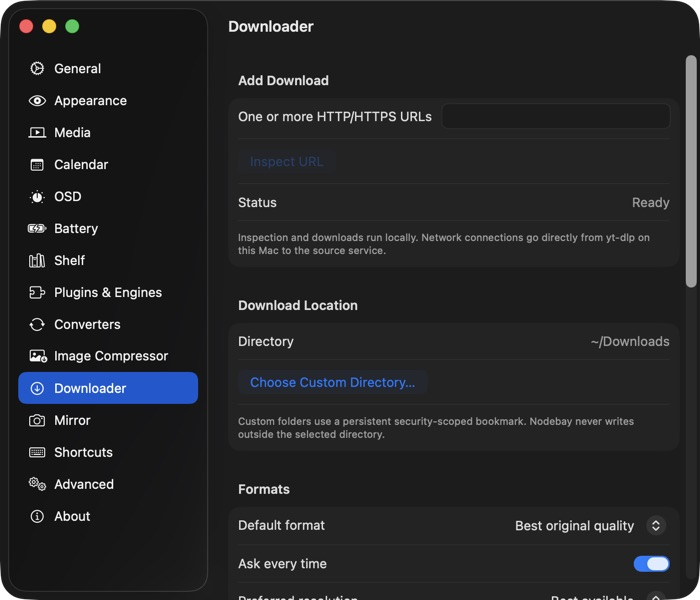
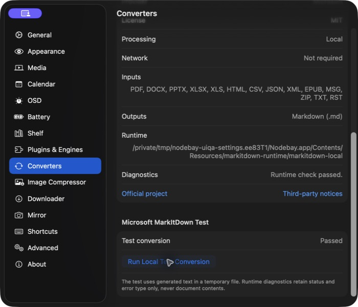
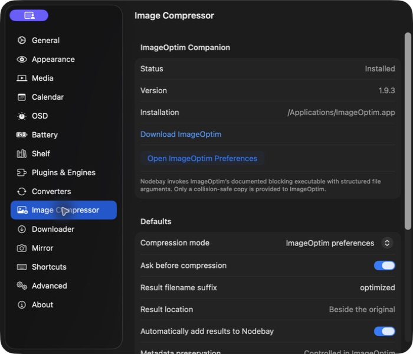
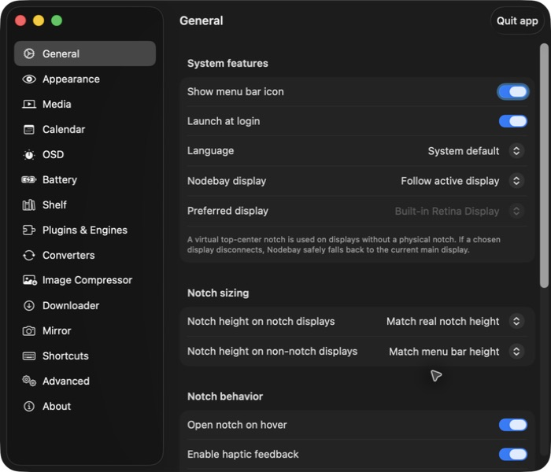
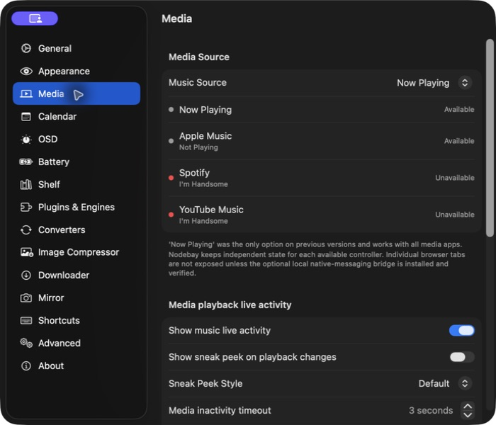
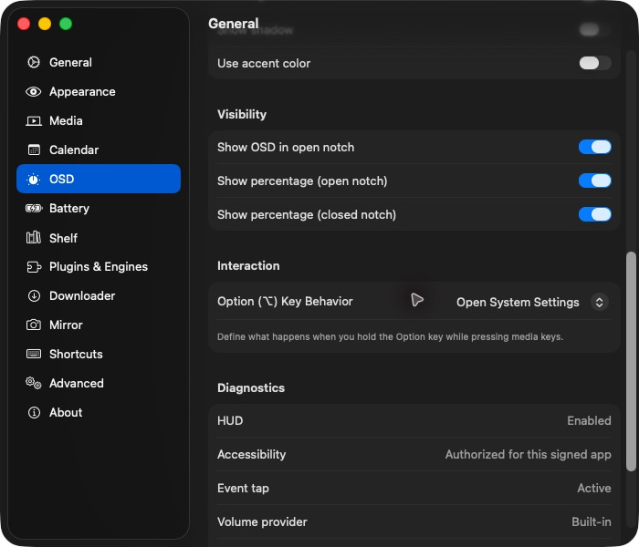
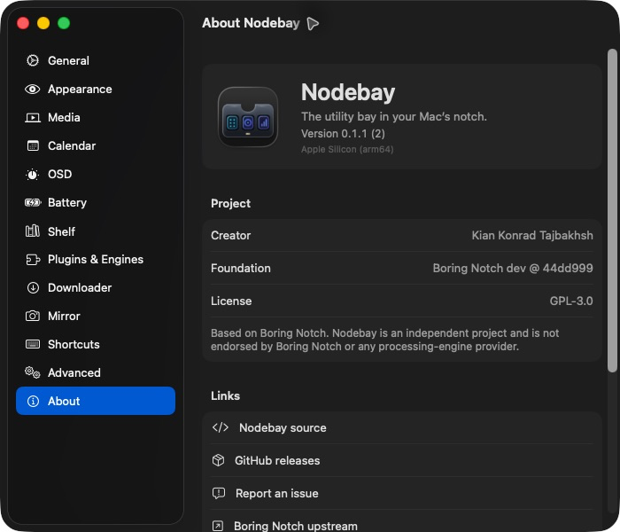
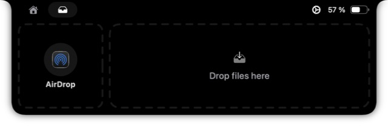
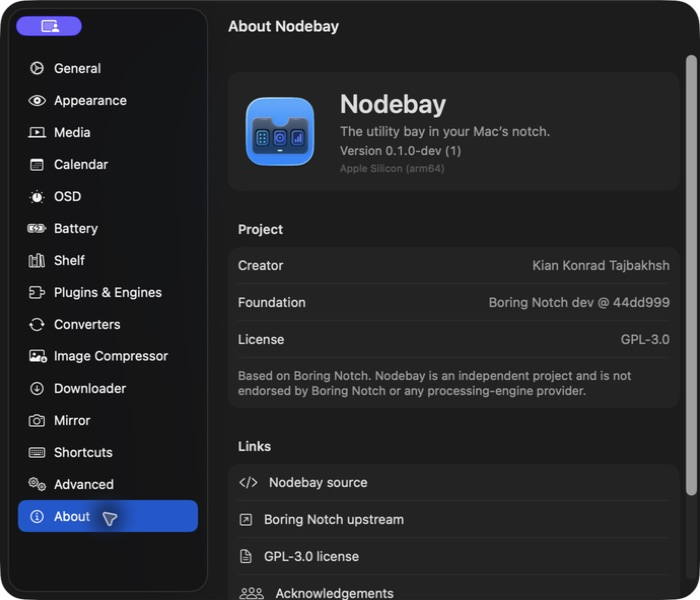

<p align="center"></p>
<h1 align="center">Nodebay</h1>
<p align="center"><strong>The utility bay in your Mac's notch.</strong></p>

Nodebay is a native, local-first macOS utility bay for MacBook displays with a physical notch and external displays with a virtual top-center notch. It combines media controls, a persistent file shelf, safe file stacks, document conversion, local media downloads, image-copy compression, calendar tools, system HUD replacement, and display-aware placement.

Nodebay is based on [Boring Notch](https://github.com/TheBoredTeam/boring.notch) at exact commit [`44dd999f70493da48209c99e9f873c47f2e55c83`](https://github.com/TheBoredTeam/boring.notch/commit/44dd999f70493da48209c99e9f873c47f2e55c83). The original project and contributors remain credited. Nodebay is GPL-3.0 software and is not affiliated with or endorsed by Microsoft, YouTube, ImageOptim, Spotify, Apple, or the other service and engine providers it can work with.

Created by **Kian Konrad Tajbakhsh**.

## Current release status

Nodebay 1.0.0 is the first stable Apple Silicon release line. It includes automatic audio-or-video download selection, external-display and external-volume drag routing, safe MP4 compression, bounded video-to-GIF conversion, durable Markdown outputs, and corrected PDF bullets. The optional Browser Media Bridge remains an explicit local installation and is not silently installed or enabled.

## Screenshots

These privacy-safe dark-mode screenshots come from the release source. The repository does not use inherited Boring Notch screenshots. Browser-tab screenshots will be added only after an explicit Chrome installation and end-to-end UI verification pass.

| Local engines and conversion | Downloads and safe image copies |
|---|---|
|  |  |
|  |  |

| Displays, media, shelf, and attribution | |
|---|---|
|  |  |
|  |  |
|  |  |

## Features

The following capabilities are implemented in the current source. Automated checks cover the safety and processing contracts described below. Hardware-dependent and final end-to-end UI checks that have not been rerun are explicitly listed as pending in the [release verification matrix](docs/release-verification-matrix.md); they are not claimed as release-verified.

- Native notch UI on the built-in display and a virtual notch on external displays
- Explicit built-in, selected, main, pointer-active, and all-display placement modes
- Persistent shelf references with security-scoped bookmarks
- Persistent named File Stacks with reorder, preview, dissolve, and multi-file Finder drag
- Local conversion through unmodified Microsoft MarkItDown 0.1.7
- Batch conversion into a separate Markdown result stack with progress, cancellation, partial success, and aggregate errors
- Local yt-dlp downloads with automatic audio-or-video selection, one-click MP4/MP3 overrides, playlist item classification, and optional FFmpeg processing
- Copy-first ImageOptim integration that never sends an original file to ImageOptim
- [Local MP4 video compression](docs/features/video-compression.md) into separate H.264/AAC copies, with cancellation and size comparisons
- [Bounded video-to-GIF conversion](docs/features/video-to-gif.md) for short MP4, MOV, and M4V files
- Independent Apple Music, Spotify, YouTube Music, and system Now Playing source state with an explicit active control target
- Optional independent Chrome tab sources for playable YouTube and YouTube Music tabs through a local first-party bridge
- Provider-registry settings for engines, converters, diagnostics, versions, privacy behavior, and license links
- XPC-isolated engine execution with structured arguments, strict executable allowlisting, bounded logs, timeouts, and cancellation

## File safety

Nodebay never overwrites, moves, modifies, or deletes an original shelf file.

- Removing a tile removes only Nodebay's reference and supports Undo.
- Dissolving a stack preserves every member reference.
- Markdown conversion creates a collision-safe, persistent `.md` copy in Nodebay-managed storage.
- MP4 compression and video-to-GIF conversion create separate outputs and never modify the source video.
- Image compression first creates a collision-safe copy and passes only that copy to ImageOptim.
- Downloaded media remains in the configured download directory while Nodebay stores a reference.
- Generated files remain regular file URLs that can be dragged into Finder or another app.

## Privacy model

Document conversion, image compression, file and stack management, and media processing run locally. Nodebay has no analytics endpoint, proxy, download server, or Nodebay cloud account.

Network access is used only by features that inherently need it: yt-dlp connects directly to the URL selected by the user, optional lyrics query LRCLIB, and playback artwork may be loaded from the source-provided URL. Browser-cookie access is disabled by default. The optional Chrome bridge uses native messaging and loopback only; it does not send browser media metadata to a server.

See [PRIVACY.md](PRIVACY.md) for the complete network and permissions disclosure.

## Engines and companions

| Integration | Version or status | Packaging | Local | Network |
|---|---:|---|---:|---:|
| [Microsoft MarkItDown](https://github.com/microsoft/markitdown) | 0.1.7 | Bundled, unmodified runtime | Yes | No |
| [yt-dlp](https://github.com/yt-dlp/yt-dlp) | Tested with 2026.8.19 | Separate Homebrew companion | Yes | Yes, direct to source |
| [FFmpeg](https://ffmpeg.org) | Tested with Homebrew 9.0.1 | Separate Homebrew companion | Yes | No |
| [ImageOptim](https://imageoptim.com/mac) | Tested with 1.9.3 | Separate app in `/Applications` | Yes | No |
| Browser media bridge | 0.1.0 | Bundled first-party extension and native host; explicit Chrome setup | Yes | No server |

Exact Swift package revisions, licenses, source URLs, companion status, the FFmpeg build configuration, and full texts are recorded in [THIRD_PARTY_NOTICES.md](THIRD_PARTY_NOTICES.md), [THIRD_PARTY_LICENSES_MARKITDOWN](THIRD_PARTY_LICENSES_MARKITDOWN), and [`third_party/nodebay-components.json`](third_party/nodebay-components.json).

## Requirements

- Apple Silicon Mac
- macOS 15 Sequoia or later. The current MediaRemoteAdapter foundation binary is built with a macOS 15.0 minimum.
- ImageOptim installed separately for image compression
- yt-dlp and FFmpeg installed separately for media downloads and conversion

Companion installation for development:

```bash
brew install yt-dlp ffmpeg
```

Download ImageOptim from its [official website](https://imageoptim.com/mac).

## Installation

Install the signed and notarized Apple Silicon release with Homebrew:

```bash
brew tap Kian-hdr/nodebay
brew trust --cask Kian-hdr/nodebay/nodebay
brew install --cask Kian-hdr/nodebay/nodebay
```

Homebrew 6 requires the one-time `brew trust` command for casks from third-party taps. It trusts only the Nodebay cask, not every package in the tap.

See [Homebrew installation](docs/homebrew.md) and the [release packaging details](docs/homebrew-nodebay.md).

For manual installation, download the Apple Silicon DMG from [Nodebay Releases](https://github.com/Kian-hdr/nodebay/releases), verify the published SHA-256 checksum, open it, and drag `Nodebay.app` to Applications.

## Build from source

Prerequisites: Xcode 26 or later, Homebrew Python 3.13, and Apple Silicon.

```bash
git clone https://github.com/Kian-hdr/nodebay.git
cd nodebay
git switch dev
brew install python@3.13
./scripts/build_markitdown_runtime.sh
./scripts/test_markitdown_runtime.sh
./scripts/test_downloader_local.sh
./scripts/test_imageoptim_local.sh
xcodebuild \
  -project boringNotch.xcodeproj \
  -scheme boringNotch \
  -configuration Debug \
  -destination 'platform=macOS,arch=arm64' \
  build
```

The bundled MarkItDown runtime is generated and excluded from Git. Its full dependency lock and notices are reproducible from the checked-in scripts and requirements.

## Reproducible Apple Silicon package

```bash
./scripts/package_homebrew_arm64.sh
```

The script builds the runtime, executes real PDF and DOCX fixtures, performs a clean Release build, stages `Nodebay.app`, installs license and privacy records, verifies arm64 executables and the staged signature, and produces a ZIP plus SHA-256 under `build/nodebay-homebrew-arm64-release/`.

Public distribution still requires Developer ID signing and notarization. An ad-hoc signature is suitable only for local verification.

For a Developer ID package, use the exact identity and team already installed in the signing keychain:

```bash
SIGNING_IDENTITY="Developer ID Application: Your Name (TEAMID)" \
DEVELOPMENT_TEAM="TEAMID" \
./scripts/package_homebrew_arm64.sh
```

The script asks Xcode to sign the app and XPC service with their target entitlements, signs every bundled MarkItDown Mach-O component with the same Developer ID and hardened runtime, then reseals the final app after installing notices. Notarization is a separate explicit release step.

Verify the resulting archive before notarization:

```bash
./scripts/verify_release_artifact.sh
```

After notarization and stapling, set `REQUIRE_NOTARIZED=1` to add Gatekeeper and staple validation.

## Permissions

- Files and folders: persistent shelf references and chosen output locations
- Accessibility: optional system HUD replacement and related controls
- Apple Events: Apple Music and Spotify control
- Calendar: optional calendar and reminders features
- Camera and microphone or audio capture: optional mirror, camera, and waveform features
- Network client: direct downloads, optional lyrics, artwork, and local media companions
- Local networking: the existing local YouTube Music companion integration
- Chrome extension: optional native messaging and site access limited to YouTube and YouTube Music

Nodebay keeps the legacy `theboringteam.boringnotch` bundle identifier in the first migration-safe build so existing preferences, bookmarks, saved shelf state, and Accessibility authorization remain usable. The user-visible product and release artifacts are Nodebay. A future bundle-identifier change must ship with a signed, tested migration.

## Known limitations

- Individual browser-tab control currently supports explicitly permitted Google Chrome tabs on `www.youtube.com` and `music.youtube.com`. Other browsers and sites fall back to system Now Playing.
- Chrome requires the bundled extension to be loaded explicitly; Nodebay cannot silently install or enable it.
- ImageOptim behavior follows the installed app's preferences. Nodebay reports that status and always protects the source through a copy-first workflow.
- Physical multi-monitor, clamshell, Spaces, full-screen, Mission Control, and Stage Manager regression checks require the final manual hardware test pass.
- The update feed is intentionally absent in this unpublished build.

## Icon source

The original Nodebay icon was authored as layered artwork and assembled in Apple Icon Composer. Editable source and all exported appearances are under [`Design/NodebayIcon`](Design/NodebayIcon). Production sizes are generated by `scripts/generate_nodebay_appicon_assets.sh`.

## Licensing and attribution

Nodebay is licensed under [GPL-3.0](LICENSE). Modified binary distributions must preserve notices and provide corresponding source and reproducible build instructions as required by the license.

- Based on [Boring Notch](https://github.com/TheBoredTeam/boring.notch), GPL-3.0
- Document conversion by [Microsoft MarkItDown](https://github.com/microsoft/markitdown), MIT
- Download integration for [yt-dlp](https://github.com/yt-dlp/yt-dlp), distribution-dependent licensing documented in notices
- Media processing through [FFmpeg](https://ffmpeg.org), exact build-license result documented in notices
- Optional compression through separately installed [ImageOptim](https://imageoptim.com/mac)

Nodebay does not fork or modify MarkItDown, yt-dlp, FFmpeg, or ImageOptim.

## Contributing and support

Read [CONTRIBUTING.md](CONTRIBUTING.md) before opening a pull request. Use [SUPPORT.md](SUPPORT.md) for privacy-safe reporting guidance and [SECURITY.md](SECURITY.md) for private vulnerability disclosure.

Nodebay is an independent project. Questions about the Boring Notch foundation should be directed to its [upstream repository](https://github.com/TheBoredTeam/boring.notch).

## Documentation

- [Installation](docs/installation.md), [Homebrew](docs/homebrew.md), and [permissions](docs/permissions.md)
- [Privacy and security](docs/privacy-and-security.md), [architecture](docs/architecture.md), and [troubleshooting](docs/troubleshooting.md)
- [Building from source](docs/building-from-source.md) and [reproducible release process](docs/release-process.md)
- [Migration from Boring Notch](docs/migration-from-boring-notch.md), [acknowledgements](ACKNOWLEDGEMENTS.md), and [changelog](CHANGELOG.md)
- [Security reports](SECURITY.md), [issue reporting](https://github.com/Kian-hdr/nodebay/issues), and [releases](https://github.com/Kian-hdr/nodebay/releases)
