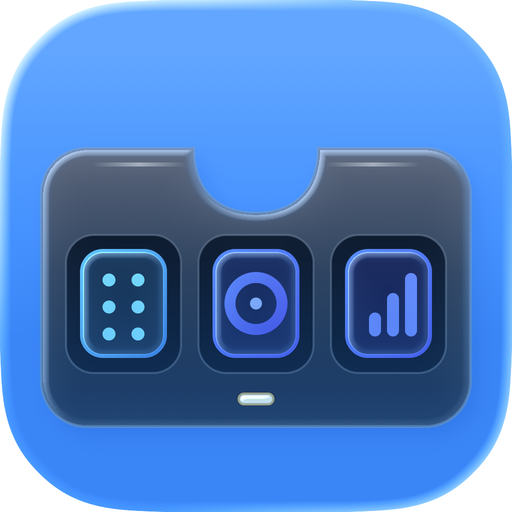

<p align="center"></p>
<h1 align="center">Nodebay</h1>
<p align="center"><strong>The utility bay in your Mac's notch.</strong></p>

Nodebay is a native, local-first macOS utility bay for MacBook displays with a physical notch and external displays with a virtual top-center notch. It combines media controls, a persistent file shelf, safe file stacks, document conversion, local media downloads, image-copy compression, calendar tools, system HUD replacement, and display-aware placement.

Nodebay is based on [Boring Notch](https://github.com/TheBoredTeam/boring.notch) at exact commit [`44dd999f70493da48209c99e9f873c47f2e55c83`](https://github.com/TheBoredTeam/boring.notch/commit/44dd999f70493da48209c99e9f873c47f2e55c83). The original project and contributors remain credited. Nodebay is GPL-3.0 software and is not affiliated with or endorsed by Microsoft, YouTube, ImageOptim, Spotify, Apple, or the other service and engine providers it can work with.

## Current release status

Nodebay is under release preparation. No public Nodebay release, Homebrew tap, update feed, browser bridge, or pull request has been published from this branch. Reproducible build and cask templates are included, but publication requires explicit final approval after review of the artifact, checksum, screenshots, notices, and verification report.

## Features

- Native notch UI on the built-in display and a virtual notch on external displays
- Explicit built-in, selected, main, pointer-active, and all-display placement modes
- Persistent shelf references with security-scoped bookmarks
- Persistent named File Stacks with reorder, preview, dissolve, and multi-file Finder drag
- Local conversion through unmodified Microsoft MarkItDown 0.1.7
- Batch conversion into a separate Markdown result stack with progress, cancellation, partial success, and aggregate errors
- Local yt-dlp downloads with explicit MP4, MP3, or best-original selection and optional FFmpeg processing
- Copy-first ImageOptim integration that never sends an original file to ImageOptim
- Independent Apple Music, Spotify, YouTube Music, and system Now Playing source state with an explicit active control target
- Provider-registry settings for engines, converters, diagnostics, versions, privacy behavior, and license links
- XPC-isolated engine execution with structured arguments, strict executable allowlisting, bounded logs, timeouts, and cancellation

## File safety

Nodebay never overwrites, moves, modifies, or deletes an original shelf file.

- Removing a tile removes only Nodebay's reference and supports Undo.
- Dissolving a stack preserves every member reference.
- Markdown conversion creates a collision-safe `.md` copy.
- Image compression first creates a collision-safe copy and passes only that copy to ImageOptim.
- Downloaded media remains in the configured download directory while Nodebay stores a reference.
- Generated files remain regular file URLs that can be dragged into Finder or another app.

## Privacy model

Document conversion, image compression, file and stack management, and media processing run locally. Nodebay has no analytics endpoint, proxy, download server, or Nodebay cloud account.

Network access is used only by features that inherently need it: yt-dlp connects directly to the URL selected by the user, optional lyrics query LRCLIB, and playback artwork may be loaded from the source-provided URL. Browser-cookie access is disabled by default. The optional browser bridge is not shipped yet, so Nodebay does not claim individual browser-tab enumeration in this source state.

See [PRIVACY.md](PRIVACY.md) for the complete network and permissions disclosure.

## Engines and companions

| Integration | Version or status | Packaging | Local | Network |
|---|---:|---|---:|---:|
| [Microsoft MarkItDown](https://github.com/microsoft/markitdown) | 0.1.7 | Bundled, unmodified runtime | Yes | No |
| [yt-dlp](https://github.com/yt-dlp/yt-dlp) | Tested with 2026.7.4 | Separate Homebrew companion | Yes | Yes, direct to source |
| [FFmpeg](https://ffmpeg.org) | Tested with Homebrew 9.0.1 | Separate Homebrew companion | Yes | No |
| [ImageOptim](https://imageoptim.com/mac) | Tested with 1.9.3 | Separate app in `/Applications` | Yes | No |
| Browser media bridge | Not shipped | Optional future extension and native bridge | Intended | No server |

Exact Swift package revisions, licenses, source URLs, companion status, the FFmpeg build configuration, and full texts are recorded in [THIRD_PARTY_NOTICES_NODEBAY.md](THIRD_PARTY_NOTICES_NODEBAY.md), [THIRD_PARTY_LICENSES_MARKITDOWN](THIRD_PARTY_LICENSES_MARKITDOWN), and [`third_party/nodebay-components.json`](third_party/nodebay-components.json).

## Requirements

- Apple Silicon Mac
- macOS 15 Sequoia or later. The current MediaRemoteAdapter foundation binary is built with a macOS 15.0 minimum.
- ImageOptim installed separately for image compression
- yt-dlp and FFmpeg installed separately for media downloads and conversion

Companion installation for development:

```bash
brew install yt-dlp ffmpeg
```

Download ImageOptim from its [official website](https://imageoptim.com/mac).

## Installation

There is no approved public Nodebay binary yet. Build the current branch from source or use the locally produced artifact after reviewing it.

The proposed public Homebrew command, after a release and tap are approved and published, is:

```bash
brew install --cask Kian-hdr/nodebay/nodebay
```

See [Homebrew distribution](docs/homebrew-nodebay.md). This command is intentionally documented as proposed and will not work until the approved public tap exists.

## Build from source

Prerequisites: Xcode 26 or later, Homebrew Python 3.13, and Apple Silicon.

```bash
git clone https://github.com/Kian-hdr/boring.notch.git
cd boring.notch
git switch feature/nodebay
brew install python@3.13
./scripts/build_markitdown_runtime.sh
./scripts/test_markitdown_runtime.sh
./scripts/test_downloader_local.sh
./scripts/test_imageoptim_local.sh
xcodebuild \
  -project boringNotch.xcodeproj \
  -scheme boringNotch \
  -configuration Debug \
  -destination 'platform=macOS,arch=arm64' \
  build
```

The bundled MarkItDown runtime is generated and excluded from Git. Its full dependency lock and notices are reproducible from the checked-in scripts and requirements.

## Reproducible Apple Silicon package

```bash
./scripts/package_homebrew_arm64.sh
```

The script builds the runtime, executes real PDF and DOCX fixtures, performs a clean Release build, stages `Nodebay.app`, installs license and privacy records, verifies arm64 executables and the staged signature, and produces a ZIP plus SHA-256 under `build/nodebay-homebrew-arm64-release/`.

Public distribution still requires Developer ID signing and notarization. An ad-hoc signature is suitable only for local verification.

For a Developer ID package, use the exact identity and team already installed in the signing keychain:

```bash
SIGNING_IDENTITY="Developer ID Application: Your Name (TEAMID)" \
DEVELOPMENT_TEAM="TEAMID" \
./scripts/package_homebrew_arm64.sh
```

The script asks Xcode to sign the app and XPC service with their target entitlements, signs every bundled MarkItDown Mach-O component with the same Developer ID and hardened runtime, then reseals the final app after installing notices. Notarization is a separate explicit release step.

Verify the resulting archive before notarization:

```bash
./scripts/verify_release_artifact.sh
```

After notarization and stapling, set `REQUIRE_NOTARIZED=1` to add Gatekeeper and staple validation.

## Permissions

- Files and folders: persistent shelf references and chosen output locations
- Accessibility: optional system HUD replacement and related controls
- Apple Events: Apple Music and Spotify control
- Calendar: optional calendar and reminders features
- Camera and microphone or audio capture: optional mirror, camera, and waveform features
- Network client: direct downloads, optional lyrics, artwork, and local media companions
- Local networking: the existing local YouTube Music companion integration

Nodebay keeps the legacy `theboringteam.boringnotch` bundle identifier in the first migration-safe build so existing preferences, bookmarks, saved shelf state, and Accessibility authorization remain usable. The user-visible product and release artifacts are Nodebay. A future bundle-identifier change must ship with a signed, tested migration.

## Known limitations

- Individual browser-tab media control is unavailable until an optional local native-messaging bridge has been implemented, permissioned, and tested in a named browser.
- Public macOS media APIs do not reliably enumerate every third-party app or browser tab. Nodebay falls back to system Now Playing where appropriate.
- ImageOptim behavior follows the installed app's preferences. Nodebay reports that status and always protects the source through a copy-first workflow.
- Physical multi-monitor, clamshell, Spaces, full-screen, Mission Control, and Stage Manager regression checks require the final manual hardware test pass.
- The update feed is intentionally absent in this unpublished build.

## Icon source

The original Nodebay icon was authored as layered artwork and assembled in Apple Icon Composer. Editable source and all exported appearances are under [`Design/NodebayIcon`](Design/NodebayIcon). Production sizes are generated by `scripts/generate_nodebay_appicon_assets.sh`.

## Licensing and attribution

Nodebay is licensed under [GPL-3.0](LICENSE). Modified binary distributions must preserve notices and provide corresponding source and reproducible build instructions as required by the license.

- Based on [Boring Notch](https://github.com/TheBoredTeam/boring.notch), GPL-3.0
- Document conversion by [Microsoft MarkItDown](https://github.com/microsoft/markitdown), MIT
- Download integration for [yt-dlp](https://github.com/yt-dlp/yt-dlp), distribution-dependent licensing documented in notices
- Media processing through [FFmpeg](https://ffmpeg.org), exact build-license result documented in notices
- Optional compression through separately installed [ImageOptim](https://imageoptim.com/mac)

Nodebay does not fork or modify MarkItDown, yt-dlp, FFmpeg, or ImageOptim.
