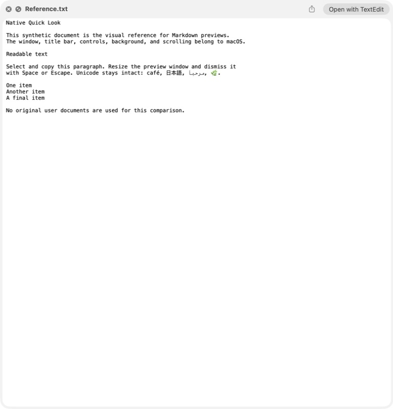
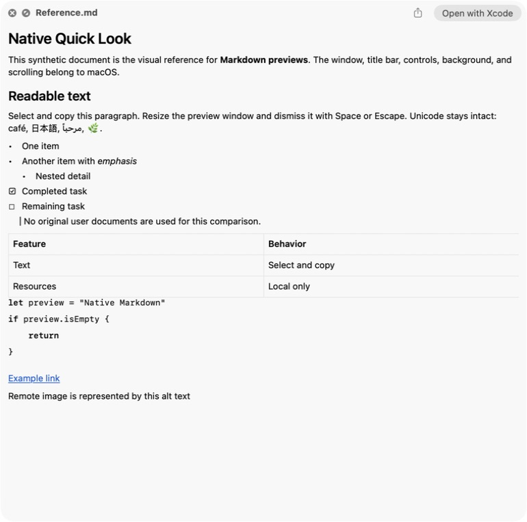
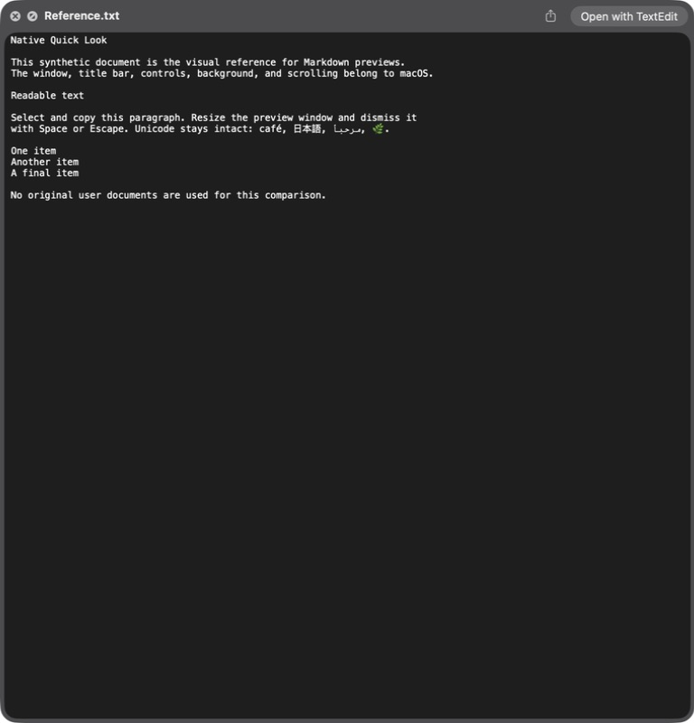
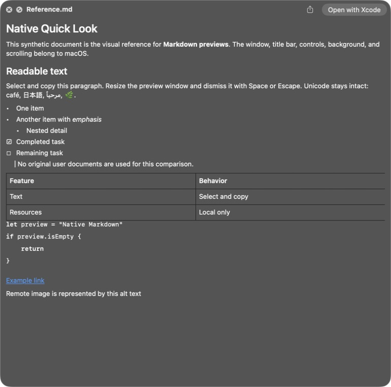

# Markdown Quick Look verification

Date: 2026-09-03. macOS 26.6.2 (25G83), Apple Silicon.
Branch: `fix/automatic-media-detection`, base
`c732fa02c63eb065d59468b837835ae21eca352b`, **uncommitted worktree**.
Prior automatic-download, Quick Notes and STL Repair changes were preserved.
No release, tag, push, notarization submission or public update was performed.

## Design decision

Inspected the actual Finder Space-bar `.txt` preview before implementing the
renderer. macOS supplies all window chrome and materials. The extension adds
only a transparent scroll view and selectable text view. On 2026-09-03, Kian
explicitly approved the current translucent background and requested that it
remain unchanged. Regression checks forbid added background layers.

These are sequential captures of actual Finder windows, presented side by side
for comparison, not mockups or simultaneously open Quick Look panels.

| Native `.txt`, light | Markdown, light |
|---|---|
|  |  |

| Native `.txt`, dark | Markdown, dark |
|---|---|
|  |  |

Apple's text renderer draws an inset document surface; Nodebay intentionally
does not reproduce it. The host's translucent background, approved by the user,
is visible throughout the Markdown content. Exact replication of Apple's
private text renderer is neither claimed nor implemented.

## Evidence matrix

| Check | Result | Evidence / boundary |
|---|---|---|
| Finder `.md` + Space | Passed | Rendered headings, emphasis, nested/task lists, quote, native table and fenced code in actual Quick Look |
| Finder `.markdown` + Space | Passed after canonical installation | An initial development registration fell back to plain text; the installed signed provider rendered the alternate fixture correctly |
| Main app quit | Passed | Installed extension process ran from `/Applications/Nodebay.app/Contents/PlugIns` while no main Nodebay process was running |
| Native chrome/materials | Passed on this Mac | System title, close/full-screen, Share/Open With; transparent extension views; no custom background or controls |
| Light/dark | Passed | Paired screenshots and live light-to-dark adaptation; original Dark setting restored |
| Reduce Transparency | Passed in dark appearance | Host switched to an opaque semantic background without any custom layer; setting restored to off |
| Resizing/scrolling | Passed | Native window shrunk, text/table reflowed, scrollbar appeared; scrolled to top and bottom |
| Text selection/copy | Passed | Command-A selected content; Command-C returned expected synthetic text; original clipboard held only in RAM and restored |
| Dismissal | Passed | Space and Escape returned to Finder |
| Source safety | Passed in tests | Byte-for-byte source preservation, read-only paths, bounded read; no writing in preview code |
| Local/resource behavior | Passed in code and entitlements; bounded runtime observation | No WebKit, URLSession, resource loader or network entitlement; remote image becomes alt text; no IP sockets observed in one extension-process snapshot. No whole-machine packet-capture claim |
| Renderer tests | Passed | 8 Swift tests: formatting, tables, links/resources, Unicode/malformed input, size bounds, file preservation, UTF-16, nested lists/code |
| Complete regression suite | Passed | Final run: 146 Python tests in 29.513 seconds, including invocation of the 8-test Swift renderer suite |
| Clean Debug / signed Release | Passed | Apple Silicon, unchanged macOS 15 floor, existing scheme embeds extension |
| Signing | Passed | Deep strict validation, Developer ID team HZWY8HT54D, hardened runtime, stable app designated requirement matches previous installation |
| Gatekeeper / stapled ticket | Failed distribution checks, expected for this private build | `spctl` reports Unnotarized Developer ID; no stapled ticket. No security protections were bypassed or disabled; this is not a public-distribution artifact |
| Shelf preview | Existing implementation preserved | QuickLookService unchanged; full regression suite passed. Separate hands-on Shelf preview regression not performed in this task |
| Accessibility | Partial | Native selectable text/accessibility tree and keyboard commands; Reduce Transparency verified. Full VoiceOver/Accessibility Inspector and Increase Contrast matrix not run |
| Other macOS versions | Not run | Deployment metadata preserves macOS 15; only macOS 26.6.2 physically exercised |
| Performance | Partial | Bounded-input tests and observed responsive fixture interaction; no Instruments, large-file frame-time or memory benchmark |
| Third-party notices | Passed | Existing notice validator passed; no third-party dependency added; Nodebay code remains under repository GPL license |
| Notarization/publication | Not run | Local approved installation only; not a release-ready public artifact |

Additional actual-window evidence:

- [Native selection](screenshots/markdown-preview/markdown-selection-light.png)
- [Narrow-window reflow](screenshots/markdown-preview/markdown-reflow-light.png)
- [Reduce Transparency](screenshots/markdown-preview/markdown-reduced-transparency-dark.png)
- [Installed `.markdown` preview](screenshots/markdown-preview/alternate-markdown-installed.png)

## Local installation and rollback

The user explicitly approved replacing the local app with the signed candidate,
including the other unpublished work already present in this checkout.
Installed destination: `/Applications/Nodebay.app`, 1.0.0 (23).
Provider: `theboringteam.boringnotch.MarkdownPreview`.
No competing third-party Markdown extension was registered initially, and none
was disabled. Only Nodebay's own extension was explicitly enabled.

Before replacement, the prior app was archived outside Git in local backup
storage. A separate recoverable copy was also retained. Private backup paths
and recovery identifiers are intentionally omitted from public documentation.
No preferences, bookmarks, shelf data, user documents or Accessibility database
records were removed or rewritten during installation.
The installed app was relaunched successfully after the extension-only check.
There is one Nodebay app in `/Applications`; temporary Debug/Release app and
updater registrations were removed, leaving only the installed Markdown provider.

To undo only Markdown preview activation:

```sh
pluginkit -e ignore -i theboringteam.boringnotch.MarkdownPreview
```

To restore the prior app, quit Nodebay and close Quick Look, move the new app to
recoverable storage, extract the backup ZIP into `/Applications`, then register
the restored app. Do not extract over a running or existing app bundle.

## Reproduction

Private build/test logs were retained outside Git:
`renderer-tests.log`, `all-tests-final.log`, `debug.log`, `release-final.log`,
`artifact-verification.log`.
The Xcode command uses the `boringNotch` scheme, arm64 destination, clean build,
Developer ID identity, hardened runtime and `CURRENT_PROJECT_VERSION=23` override.
The source marketing/build versions were not changed for public release.

Run the commands in [feature documentation](features/markdown-preview.md), then
use the synthetic fixtures in `tests/fixtures/markdown-preview`. Do not substitute
proprietary user documents for screenshots or test fixtures.

Local signed, unnotarized candidate ZIP (outside Git):
`Nodebay-Markdown-Preview-1.0.0-build23-arm64.zip`

SHA-256: `ef61bea2b39f8f87df75e92b935e5c05fa8c34933b263b092563992532d5b03d`.
This is a private development artifact, not a distributable public release.
