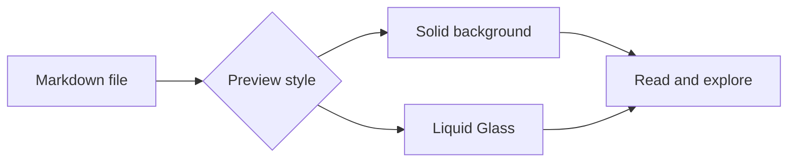
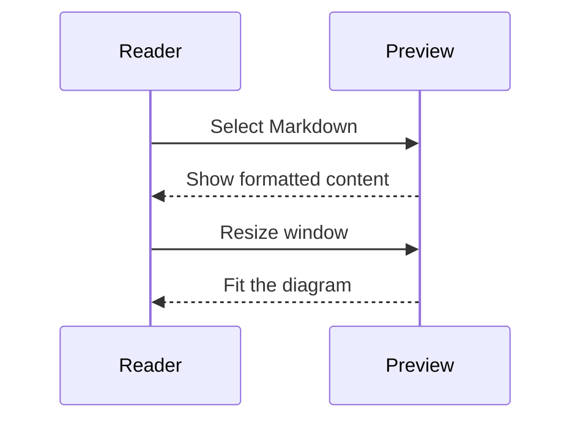
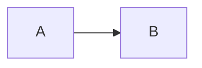

# Diagrams in Markdown

Mermaid diagrams stay inside the preview, alongside normal text and tables.

## Flowchart



There should be comfortable spacing before and after this diagram.

## Sequence



## Table and code

| Feature | Behavior |
| --- | --- |
| Background | Remember your choice |
| Diagrams | Render locally |

```swift
let preview = "Readable Markdown"
if !preview.isEmpty {
    print(preview)
}
```

This paragraph should be clearly separated from the code above.

## Repeated diagrams




Both identical diagrams should appear independently.
